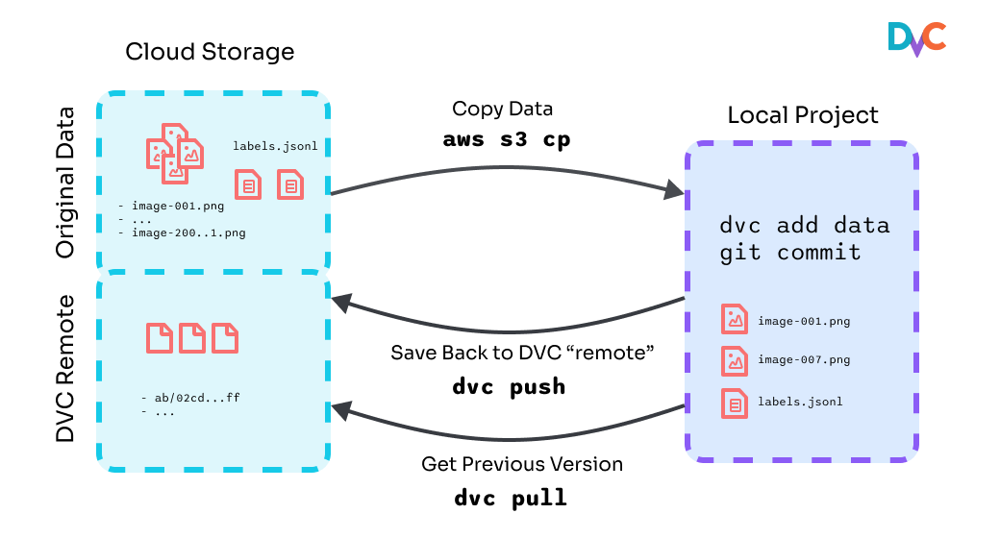
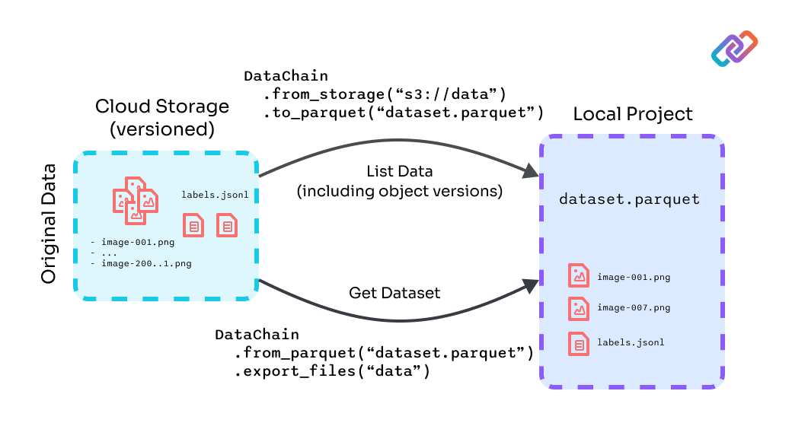

# Versionsing datasets with DataChain and DVC

Note: the purpose of this project is to explore a very basic way of using
DataChain along with DVC in a single repo, while preserving similar to DVC
semantics (e.g. instantiating files in the project like `dvc pull` does) while
mitigating some DVC limitations - working with a large amount of small files,
calculating hashes, etc. DataChain gives way more benefits, it also can be used
in a different way (e.g. use Pytorch data loader without instantiating data).
It is out of scope here to cover all those features and possible ways to use
it.

## Intro

This is a Computer Vision (CV) project that solves the problem of segmenting out 
swimming pools from satellite images.

[Example results](./results/evaluate/plots/images/)

We use a slightly modified version of the [BH-Pools dataset](http://patreo.dcc.ufmg.br/2020/07/29/bh-pools-watertanks-datasets/):
we split the original 4k images into tiles of 1024x1024 pixels.

🐛 Please report any issues found in this project here -
[example-repos-dev](https://github.com/iterative/example-repos-dev).

## Installation

Python 3.9+ is required to run code from this repo.

```console
$ git clone https://github.com/shcheklein/example-datachain-dvc
$ cd example-datachain-dvc
```

Now let's install the requirements. But before we do that, we **strongly**
recommend creating a virtual environment with a tool such as
[virtualenv](https://virtualenv.pypa.io/en/stable/):

```console
$ python -m venv .venv
$ source .venv/bin/activate
# pip install uv
$ uv pip install -r requirements.txt
```

## Running in your environment

Run [`dvc exp run`](https://man.dvc.org/exp/run) to reproduce the
[pipeline](https://dvc.org/doc/user-guide/pipelines/defining-pipelinese):

```console
$ dvc exp run
Data and pipelines are up to date.
```

If you'd like to test commands like [`dvc push`](https://man.dvc.org/push),
that require write access to the remote storage, the easiest way would be to set
up a "local remote" on your file system:

> This kind of remote is located in the local file system, but is external to
> the DVC project.

```console
$ mkdir -p /tmp/dvc-storage
$ dvc remote add local /tmp/dvc-storage
```

You should now be able to run:

```console
$ dvc push -r local
```

## Data versioning

The basic approach to versioning data with DVC alone is outlined in the
diagram:



It's well described in the DVC [Get Started](https://dvc.org/doc/start) and in
the [Data and Model Versioning](https://dvc.org/doc/use-cases/versioning-data-and-models/tutorial)
tutorial.

The DataChain + DVC data versioning introduces a level of indirection and works
better in case if there are many files in the dataset, if there is a need to 
work with these files' metadata (e.g. pick only specific images) or need to run
data transformations or training w/o instantiating those files (streaming):



The fist script `src/dc/index.py` produces a `dataset.parquet` file. It serves
as a "dataset version". Essentially it is a list of files in the bucket with
some filering + or additional info as needed. This file then can be versioned
by DVC instead of the original (images on the diagram) set of files. It saves
tons of time by avoiding reading files and calculating hashes.

The second script `src/dc/export.py` is used to instantiate the dataset by
reading a currently checked out `dataset.parquet`, thus imitating `dvc pull`
workflow. In reality, `export_file()` might not be even needed since DataChain
has a Pytorch data loader that can stream files (with pre-fetch and caching).

To highlight the key differences:

**DataChain doesn't move / copy data**

DataChain captures the list of objects (images, videos, audio, etc) and if
needed combines it with metadata (lables, bounding boxes, embeddings, etc)
extracted fromJSONs, parquet, or even extracted and creted dynamically by
processing objects (e.g. predictions, embeddings, etc).

**DataChain doesn't calculate hashes**

DataChain relies on cloud versioning (all major cloud support it) to capture
a specific object version (version id). So, if an object is modified or removed
it still can be retrieved later (versioning should be enabled). There is no
need to calculate hashes like DVC does.

**DataChain doesn't require instantiating files**

DataChain has Pytorch data loader that can stream data and help avoiding
materializing the dataset like `dvc pull` does (doesn't really work for a
large dataset, can be expensive, etc). Note: this repo doesn't have an
example of using data loader, it was made specifically to imitate `dvc pull`.
Check the [docs](https://docs.datachain.ai/examples/#passing-data-to-training).

## Project structure

The data files, DVC files, and results change as stages are created one by one.
After cloning and using [`dvc pull`](https://man.dvc.org/pull) to download
data, models, and plots tracked by DVC, the workspace should look like this:

```console
$ tree -L 2
.
├── LICENSE
├── README.md
├── data.            # <-- Directory with raw and intermediate data
│   ├── pool_data    # <-- Raw image data
│   ├── pool_data.dvc # <-- .dvc file - a placeholder/pointer to raw data
│   ├── test_data    # <-- Processed test data
│   └── train_data   # <-- Processed train data
├── dvc.lock
├── dvc.yaml         # <-- DVC pipeline file
├── models
│   └── model.pkl    # <-- Trained model file
├── params.yaml      # <-- Parameters file
├── requirements.txt # <-- Python dependencies needed in the project
├── results          # <-- DVCLive reports and plots
│   ├── evaluate
│   └── train
└── src              # <-- Source code to run the pipeline stages
    ├── data_split.py
    ├── evaluate.py
    └── train.py
```
